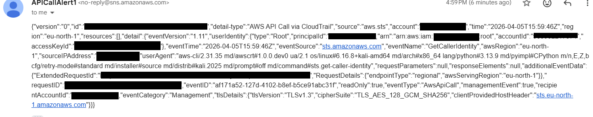

# AWS_Cloud_Security_Solution
This project inolves a high fidelity threat detection system engineered to monitor AWS CloudTrail for unauthorised GetCallerIdentity API calls. This solution leverages custom Eventbridge rules to identify "Who am I?" reconnaissance patterns and tiggers instant SNS alerts to ensure rapid response to potential credential compromise.

## 🛠️ Project at a Glance
1. **SNS Topic Setup:** Established real-time email alerting.
2. **CloudTrail:** Enabled global logging for account-wide visibility.
3. **EventBridge:** Deployed custom JSON rule to detect `GetCallerIdentity`.
4. **Simulation:** Connected via CLI on Kali Linux to mimic an attacker.
5. **Validation:** Verified high-fidelity alerts in the security inbox.

## 📁 Technical Documentation
For the full step-by-step configuration and technical breakdown, see the:
👉 [Detailed Deployment Guide](./deployment.md)

## 📊 Final Evidence
The system successfully detected the Kali Linux simulation.

  
<b>Click to view alert evidence</b>

  

